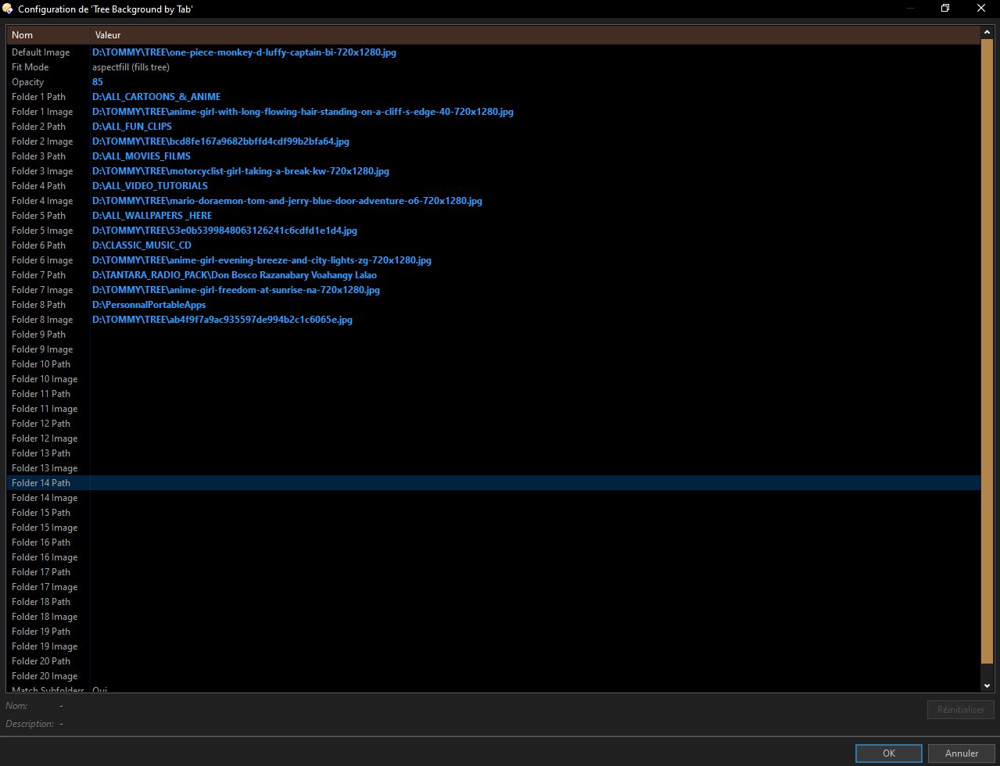

📂 Tree Background by Tab (Directory Opus Script)

Overview
Tree Background by Tab is a Directory Opus script that dynamically changes the folder tree background image based on the active tab’s location. This allows you to visually distinguish different folders with custom backgrounds, making navigation more intuitive and personalized.

Whenever you switch tabs or navigate to a new folder, the script automatically updates the tree background according to your configured rules.

---

✨ Features
- Up to 20 configurable folder mappings  
  - Each folder path can be assigned its own background image.  
  - Example: Documents → documents.jpg, Downloads → downloads.jpg, etc.
- Default background image  
  - Used when no folder mapping matches the current location.
- Subfolder matching  
  - Optionally apply the parent folder’s background to all its subfolders.  
  - Example: C:\Users\Name\Documents\Work will use the Documents background.
- Image display modes (Fit/Fill/Center/Stretch)  
  - aspectfit → Shows the entire image without cropping (recommended).  
  - aspectfill → Fills the tree completely (may crop edges).  
  - center → Displays the image at original size, centered.  
  - stretch → Stretches the image to fill the tree.
- Transparency control (Opacity)  
  - Adjustable from 1 (invisible) to 100 (solid).  
  - Recommended range: 20–30 for readability.
- Automatic updates  
  - Background changes on tab activation or folder navigation.  
- Performance‑friendly  
  - Avoids redundant updates by checking if the background is already set.

---

⚙️ Configuration
The script exposes settings in Script Config:

| Setting | Description | Default |
|---------|-------------|---------|
| Default Image | Path to fallback background image | C:\Users\%username%\Pictures\default.jpg |
| Fit Mode | How the image is displayed (aspectfit, aspectfill, center, stretch) | aspectfit |
| Opacity | Transparency level (1–100) | 25 |
| Folder X Path | Path to monitor (up to 20 folders) | Example: C:\Users\%username%\Documents |
| Folder X Image | Background image for the folder | Example: C:\Users\%username%\Pictures\documents.jpg |
| Match Subfolders | Apply parent folder’s image to subfolders | true |

---

🔧 How It Works
1. Initialization  
   - Loads configuration, sets defaults, and prepares up to 20 folder mappings.
2. Event Hooks  
   - OnActivateTab → Triggered when switching tabs.  
   - OnAfterFolderChange → Triggered when navigating folders.  
3. Background Selection  
   - Resolves the current folder path.  
   - Checks against configured mappings.  
   - Falls back to default image if no match.  
4. Background Update  
   - Applies the chosen image with the configured fit mode and opacity.  
   - Stores the current background to avoid redundant updates.  

---

📌 Example Use Case
- Documents Tab → Background set to documents.jpg  
- Downloads Tab → Background set to downloads.jpg  
- Pictures Tab → Background set to photos.jpg  
- Any other folder → Background set to default.jpg  

Subfolders like Documents\Work or Downloads\Temp will inherit their parent’s background if Match Subfolders is enabled.

---

📝 Notes
- Ensure all image paths exist; missing files will be logged in the Opus output.  
- Paths are resolved automatically (e.g., %username% expands to the current user).  
- Opacity and fit mode are applied consistently across all backgrounds.

- ## 📸 Script Settings Screenshots

---

🌹 Here’s how the configuration looks inside Directory Opus:

---

1 - Tree Background Overview

---

2 - Tree Background Overview

---

3 - Script Configuration 

---

🌿🌹 Watch Demo Here 🌹🌿

---

---
